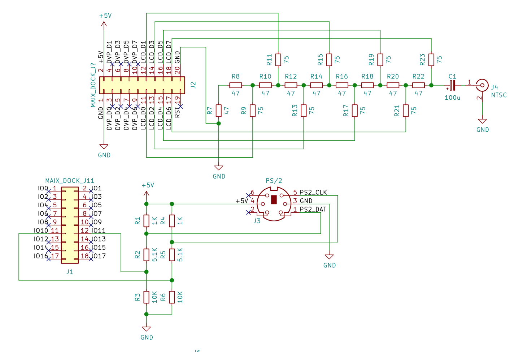

# fMSX210
fMSX を Sipeed の Maix シリーズ向けに移植したものです。
付属の LCD での映像出力のほか、コンポジットビデオでの映像出力に対応しています。

[Download](https://github.com/shuichitakano/fmsx210/releases/download/v0.1/fmsx210_v0.1.zip)

## 動作環境
Maix Dock, Maix Go, Maixduino で動作します。
コンポジットビデオ出力を使用するには、LCD のポートがヘッダに出ているボード(Maix Dock/Go を使用するのがおすすめです。
コンポジットビデオと PS/2 キーボードの動作確認は Maix Dock のみで行なっています。

## 回路
Maix Dock での回路例を示します。


- コンポジットビデオの DAC 部には金属皮膜抵抗を使用してください
- 液晶で使用する場合は PS/2 ポート部分だけ制作してください

## 実行
以下の ROM を Micro SD のルートディレクトリに置いて起動してください。

- MSX2.ROM
- MSX2EXT.ROM
- DISK.ROM
- KANJI.ROM

### settings.json 

ルートディレクトリに置いた settings.json で起動設定が可能です。

|キー|意味|
|:--|:--|
|default_rom0|スロット1の ROM イメージを指定します|
|default_rom1|スロット2の ROM イメージを指定します|
|default_disk0|ドライブ A のディスクイメージを指定します|
|default_disk1|ドライブ B のディスクイメージを指定します|
|ram_pages|搭載 RAM のページ数を指定します|
|vram_pages|搭載 VRAM のページ数を指定します|
|video|ビデオ出力方式を指定します<br>LCD: 液晶<br>NTSC: コンポジットビデオ|
|flip_lcd|液晶出力時、true で 180度反転します|
|audio_enable_pin|オーディオを有効にする IO ポートを指定します<br>Maix Go: 32<br>Maixduino: 2|
|volume|オーディオ出力の音量を指定します(0-255)|

## 操作方法
|キー|機能|
|:--|:--|
|F10|メニューを開く|
|ENTER|決定|
|ESC|メニューを閉じる|
|Up (Maix go)|音量上げ/メニュー上|
|Down (Maix go)|音量下げ/メニュー下|
|Center (Maix go)|メニュー開く/決定|


## ビルド方法
ライセンスの関係上 fMSX のソースは含まれていません。
third_party/fMSX54 以下に fMSX のソースを展開してビルドを行なってください。

```
mkdir build
cd build
cmake -DTOOL_CHAIN=/usr/local/opt/kendryte-toolchain/bin -DCMAKE_BUILD_TYPE=Release ..
make -j4
```

## 書き込み
kflash 等を使用してボードに書き込んでください。
```
例)
kflash -b 1500000 -p /dev/cu.usbserial-14101 -t fmsx.bin
```


